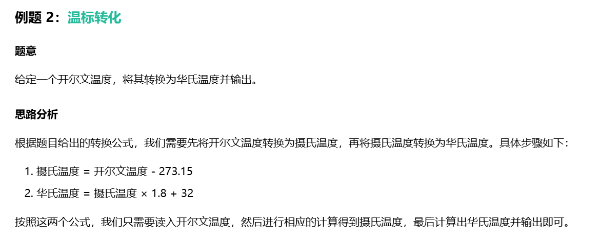
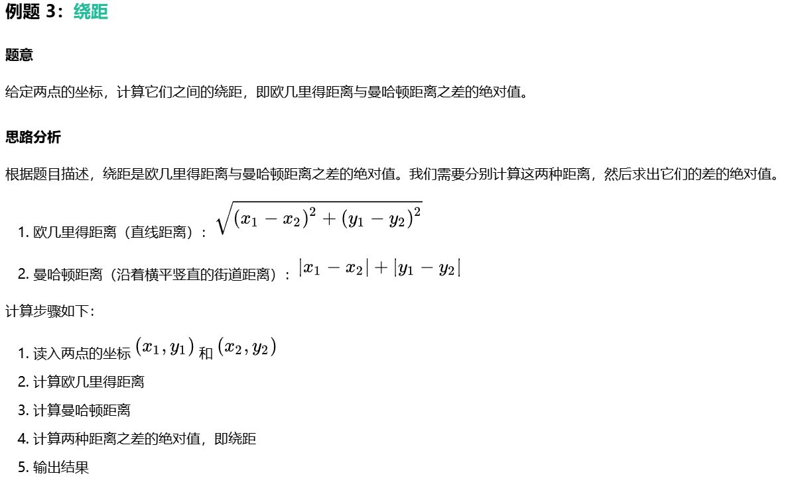

# 顺序结构

## 基本概念
顺序结构是最基本的程序结构，程序按照语句的先后顺序依次执行。它是程序中最简单的流程控制，没有任何判断和跳转。

顺序结构代码的核心特点是：

>1. 按照语句的先后顺序执行
>2. 每个语句都会被执行一次


  
```cpp
代码实现：
#include <bits/stdc++.h>
using namespace std;
int main() {
    int n;  //定义变量n用来输入那个四位数
    cin >> n;  //输入n
    int ge, shi, bai, qian;    //定义变量ge,shi,bai,qian分别表示个位，十位，百位，千位
    ge = n % 10; //对10取模得到个位数
    n /= 10;   //把此时的个位抛弃掉，得到三位数
    shi = n % 10;//对10取模得到个位数
    n /= 10;   //把此时的个位抛弃掉，得到两位数
    bai = n % 10;//对10取模得到个位数
    n /= 10;   //把此时的个位抛弃掉，得到一位数
    qian = n % 10;//对10取模得到个位数
    cout << ge << shi << bai << qian; //反向输出
    return 0;//结束程序
}
```

](./img/image-1.png)

```cpp
代码实现：
#include <bits/stdc++.h>
using namespace std;
int main(){
    double K;  //定义变量K用来输入开尔文温度
    cin >> K;  //输入K
    double C = K - 273.15;  //将开尔文温度转换为摄氏温度
    double F = C * 1.8 + 32;  //将摄氏温度转换为华氏温度
    cout << F;  //输出华氏温度
    return 0;  //结束程序
}
```



```cpp
代码实现：
#include <bits/stdc++.h>
using namespace std;
int main(){
    int x1, y1, x2, y2;  //定义变量表示两点的坐标
    cin >> x1 >> y1;  //输入第一个点的坐标
    cin >> x2 >> y2;  //输入第二个点的坐标
    
    //计算欧几里得距离
    double euclidean = sqrt(pow(x1 - x2, 2) + pow(y1 - y2, 2));
    
    //计算曼哈顿距离
    double manhattan = abs(x1 - x2) + abs(y1 - y2);
    
    //计算绕距
    double result = abs(euclidean - manhattan);
    
    cout << result;  //输出绕距
    return 0;  //结束程序
}
