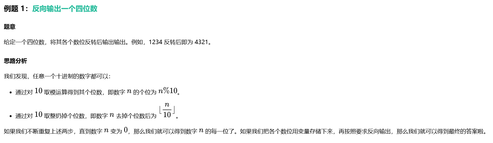
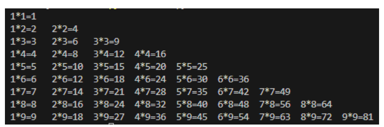

# 循环结构
## 一.基本概念
循环结构是程序中用于重复执行某段代码的控制结构。当我们需要多次执行相同或相似的操作时，使用循环结构可以避免代码重复，使程序更加简洁高效。
循环结构代码的核心特点是：

1. 重复执行某段代码，直到满足特定条件
2. 通常包含初始化、循环条件判断和更新循环变量三个部分

- 在编程语言中，常见的循环结构有 for 循环和 while 循环两种基本形式。

>for 循环
for 循环是一种常用的循环结构，通过维护一个循环控制变量，并不断判断循环控制变量是否满足某个特定条件，进而控制循环的进行。由于循环控制变量变化的范围在 for 循环中需要明确规定，for 循环的循环次数往往很轻松就能求出，所以它主要被用于明确知道循环次数的情境下。

- 循环控制变量是一个用于控制循环的变量，通过不断自我迭代变为新的数值。当循环控制变量不满足循环条件的时候，循环就会停止。循环控制变量的命名和一般变量的命名基本是一致的，但是也有一些约定：



### for 循环

>在 C++ 中，for 循环的基本语法如下：
for (循环控制变量的初始化语句; 循环条件; 循环控制变量的更新语句) {
    // 循环体，重复执行的代码
}
例如：
for (int i = 0; i < 5; i++) {
    cout << i << " ";  // 输出：0 1 2 3 4
}

```cpp
for 循环的执行流程：
1. 执行循环控制变量的初始化语句（int i = 0），只执行一次
2. 判断循环条件（i < 5），如果为真，执行循环体；如果为假，退出循环
3. 执行循环体内的代码
4. 执行循环控制变量的更新语句（i++）
5. 返回第 2 步，重复执行
需要特别注意的是，在 C++ 中，for 循环的三个部分都可以省略，但是分号 ; 不能省略。例如：

int i = 0;
for (; i < 5;) {
    cout << i << " ";  // 输出：0 1 2 3 4
    i++;
}
```

## while 循环
while 循环是另一种常用的循环结构，它在循环开始前检查条件，只要条件为真，就会重复执行循环体内的代码。由于不使用循环变量而只是单纯地判断循环条件，所以 while 循环的循环次数往往无法提前确定，所以它主要被用于知道循环进行的条件，但无法明确知道循环次数的情境下。


>在 C++ 中，while 循环的基本语法如下：

```cpp
while (循环条件) {
    // 循环体，重复执行的代码
}

例如：
int i = 0;
while (i < 5) {
    cout << i << " ";  // 输出：0 1 2 3 4
    i++;
}

while 循环的执行流程：
1.判断循环条件（i < 5），如果为真，执行循环体；如果为假，退出循环
2.执行循环体内的代码
3.返回第 1 步，重复执行
```

## 循环控制语句
>在循环结构中，有时我们需要更灵活地控制循环的执行流程。常用的循环控制语句有 break 和 continue，他们在各个编程语言中的作用基本是完全一样的。

### 1.break 语句
>break 语句用于立即退出当前循环，不再执行循环中的剩余语句。它通常与条件判断一起使用，当满足某个条件时，提前结束循环。

 C++ 中的 break

```cpp
// 在 C++ 中使用 break 查找数组中的特定元素
int arr[] = {3, 7, 2, 9, 5};
int target = 9;
int position = -1;

for (int i = 0; i < 5; i++) {
    if (arr[i] == target) {
        position = i;
        break;  // 找到目标元素后立即退出循环
    }
}

if (position != -1) {
    cout << "找到元素，位置是: " << position << endl;
} else {
    cout << "未找到元素" << endl;
}
```

#### 2.ontinue 语句
>continue 语句用于跳过当前循环的剩余语句，直接进入下一次循环。它通常用于当某个条件满足时，跳过当前迭代，继续下一次迭代。

C++ 中的 continue


```cpp
// 在 C++ 中使用 continue 打印 1 到 10 中的奇数
for (int i = 1; i <= 10; i++) {
    if (i % 2 == 0) {  // 如果 i 是偶数
        continue;  // 跳过当前循环
    }
    cout << i << " ";  // 只打印奇数
}
// 输出: 1 3 5 7 9
```

嵌套循环
循环结构可以嵌套使用，即在一个循环内部包含另一个循环。嵌套循环通常用于处理多维数据或需要多层迭代的问题。同样，循环结构里面也可以包含选择结构语句，进而形成非常复杂的逻辑。

比如说，我们要打印一个长这个样的九九乘法表：




(提示：\t 是制表符，用于让输出的内容像表格一样对齐)

```cpp
// 在 C++ 中使用嵌套循环打印乘法表
for (int i = 1; i <= 9; i++) {  // 外层循环控制行
    for (int j = 1; j <= i; j++) {  // 内层循环控制列
        cout << j << "*" << i << "=" << i*j << "\t";
    }
    cout << endl;  // 每行结束后换行
}
```
