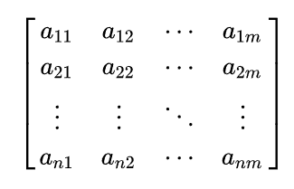

# 数组

>概述:
数组是编程中最基础、最常用的数据结构之一，它可以存储一系列相同类型的数据元素。想象一下，如果你需要存储 100 个整数，难道要定义 100 个变量吗？这显然太麻烦了！数组就像一个有序的盒子，让你可以用一个变量名统一管理多个数据，并通过索引（下标）快速访问任意位置的元素。

## 一.数组的特点
1.连续存储：数组在内存中是连续存储的，这使得访问任意元素的速度非常快
2.固定大小：创建数组时需要指定其大小，且大小通常不可变（部分语言支持动态数组）
3.相同类型：数组中的所有元素必须是相同的数据类型
4.随机访问：可以通过索引直接访问任意位置的元素，时间复杂度为O(1)

>数组的声明与初始化:
不同编程语言中，数组的声明和初始化语法略有不同，下面分别介绍几种常见语言的用法。

在 C++ 中，声明数组的基本语法如下：

```cpp
数组内元素的数据类型 数组名[数组大小];

例如，如果我要声明一个包含 5 个整数的数组，数组名叫 a，可以这样写：
int a[5];
// 声明并初始化数组为特定值
int arr2[5] = {1, 2, 3, 4, 5};

```

关于数组的声明，有几个点需要特别注意：
>1.数组的大小必须是一个非负常量表达式，不能是变量。
2.数组的大小在编译时就已经确定，不能在运行时改变。
3.定义在主函数以外的数组是全局数组，全局数组内元素的默认初始值全为默认值（数值类型为0，布尔类型为false，对象引用为null），且不占用主函数相对有限的内存空间。
4.定义在主函数以内的数组是主函数内局部数组，局部数组内元素的默认初始值不一定全为默认值，且占用主函数相对有限的内存空间。

一般情况下，笔者建议把数组定义在主函数以外。

## 二.数组的访问

* 数组中的元素通过索引（下标）来访问，索引从 0 开始计数。这意味着第一个元素的索引是 0，第二个元素的索引是 1，以此类推。
  
>数组下标是从 0 开始计数的，依次是第 0 个，第 1 个，第 2 个...第n-1个，而不是第 1 个，第 2 个...第n个，这与我们日常生活中习惯的计数方法不同。

**在有些情况下，我们可以故意把数组开大一些，然后假装数组的第一个元素（即下标为 0 的元素）不存在，直接从下标为 1 的元素开始当作第一个元素用.
这种写法在大部分情况下可以简化思维，同时减小越界错误的可能性，是笔者比较推荐的写法。**

```cpp
C++ 中数组元素的访问语法如下：
数组名[索引];
下面是默认的以 0 为第一个下标的方式访问数组元素：
int arr[5] = {10, 20, 30, 40, 50};// 声明并初始化数组

// 访问数组元素

int firstElement = arr[0];  
// 访问数组的第一个元素（10），并把对应值赋给变量firstElement
int thirdElement = arr[2];
// 访问数组的第三个元素（30），并把对应值赋给变量thirdElement

// 修改数组元素

arr[4] = 55;  // 访问数组的第五个元素（50），并将其修改为55
下面是默认的以 1 为第一个下标的方式访问数组元素：
int arr[10] = {0, 10, 20, 30, 40, 50};// 声明并初始化数组

// 访问数组元素

int firstElement = arr[1];  
// 访问数组的第一个元素（10），并把对应值赋给变量firstElement
int thirdElement = arr[3]; 
// 访问数组的第三个元素（30），并把对应值赋给变量thirdElement

// 修改数组元素

arr[5] = 55;  
// 访问数组的第五个元素（50），并将其修改为55
```

*** 需要特别注意的是，如果你访问的下标超出了数组大小所规定的下标范围（比如下标小于0 或不小于数组大小），你的代码将会出现“未定义行为”，并且在运行时出错，导致程序返回值不为 0，这是一种非常危险的行为。

## 三.数组的遍历

* 遍历数组是指按顺序访问数组中的每个元素。有多种方法可以遍历数组：

>1.通过 for 循环遍历数组下标，通过依次访问数组对应下标的元素从而遍历数组。
2.通过拓展 for 循环直接对数组进行遍历（部分语言不支持）。

```cpp
int arr[5] = {10, 20, 30, 40, 50};

// 使用 for 循环遍历下标
for (int i = 0; i < 5; i++) {
    cout << arr[i] << " ";
}
// 输出: 10 20 30 40 50

// C++11 后支持的范围for循环直接对数组进行遍历
for (int x : arr) {
    cout << x << " ";
}
// 输出: 10 20 30 40 50
```

## 四.多维数组

* 在一维数组中，我们通过唯一的一个下标来获取对应位置的元素，这像是一个数轴的非负半轴，我们只要知道一个维度的下标就可以访问到对应位置的值.  

* 二维数组就像一个二维的平面，我们只有知道了”横坐标“和”纵坐标“这两个下标，才能唯一确定一个在二维数组中的位置。实际上，二维数组更像一个矩阵，或者说是一个只有”非负整数点“的离散的平面.



>由一维数组构成的数组是二维数组，由二维数组构成的数组是三维数组，由三维数组构成的数组是三位数组......
这样的维度还可以无限向上叠加，不过道理都是一样的，无非是在数组名后面多加几个中括号，多填几个参数的事。

接下来，我们就以二维数组为例，介绍一下二维数组的用法。
### 二维数组的声明与初始化
这一部分的语法与一维数组基本一致，唯一的不同就是多了一个维度的中括号需要填数。

```cpp
// 声明一个3行4列的二维数组
int matrix[3][4];

// 声明并初始化
int matrix2[3][4] = {
    {1, 2, 3, 4},
    {5, 6, 7, 8},
    {9, 10, 11, 12}
};

// 部分初始化，未指定的元素默认为0
int matrix3[3][4] = {
    {1, 2},
    {5},
    {9, 10, 11}
};
```

### 二维数组的访问与遍历
访问二维数组第`i`行第`j`列的元素的语法为：

>`数组名[i][j];`

**在我们们访问二维数组的各个元素时，我们经常会搞混一件事：到底哪个中括号里面填行，哪个填列？一般情况下，我们约定：
• 从左往右第一个维度为行，第二个维度为列。
• 遍历数组时往往先从上到下遍历行，后从左往右遍历对应行的每一列。
• 由于我们之前约定过第一层循环一般用 i，第二层用 j，以此类推，你可以把 i 和行数、j 和列数直接联系起来**

```cpp
代码实现  
int matrix[3][4] = {
    {1, 2, 3, 4},
    {5, 6, 7, 8},
    {9, 10, 11, 12}
};

// 访问元素
int element = matrix[1][2];  // 值为7（第2行第3列）

// 修改元素
matrix[0][0] = 100;

// 使用嵌套for循环遍历
for (int i = 0; i < 3; i++) { //枚举行数 i
    for (int j = 0; j < 4; j++) {  // 枚举列数 j
        cout << matrix[i][j] << " ";
    }
    cout << endl;
}
```

### 五.数组的优缺点（了解即可）
在编程中使用数组时，了解其优缺点非常重要，这有助于我们在不同场景下做出合理的选择。下面详细分析数组的优缺点及其适用场景。

**A:优点**
>1.访问速度快：通过索引可以直接访问数组内任意元素

* 这是数组最显著的优势，特别适合需要频繁随机访问的场景

>2.内存效率高：连续存储，没有额外的结构开销

* 不需要存储指针或链接信息，节省内存空间

>3.缓存友好：连续内存布局有利于 CPU 缓存

* 现代 CPU 的缓存预取机制能更好地利用数组的连续内存特性

>4.实现简单：容易理解和使用

* 语法简单直观，学习曲线平缓

**B:缺点**
虽然数组有很多优点，但它也存在一些局限性：

>1.大小固定：创建后大小通常不可变（除非使用动态数组）

* 这意味着在创建数组时必须预先知道所需的最大空间

>2.插入和删除效率低：在数组中间插入或删除元素需要移动其他元素

* 如果在数组中间插入或删除一个元素，插入或删除元素的位置后面所有元素的位置都需要改变，这会导致大量元素的移动，消耗的时间较长。

>3.空间浪费：如果预分配的空间过大，可能造成内存浪费

* 实际使用空间远小于分配空间时，剩余空间无法被其他用途使用

>4.类型单一：只能存储相同类型的元素

* 限制了数据结构的灵活性
