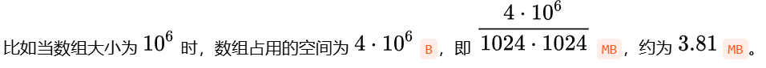
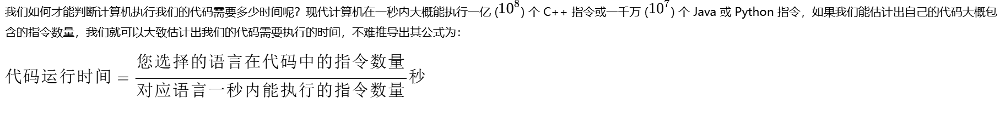

# 时空复杂度
## 一.空间复杂度

* **如何预测程序需要消耗的内存空间呢？**

在基本数据类型中，我们已经列出了各个基本数据类型单个变量所占用的内存的大小，只要统计我们代码中各个变量占用的内存之和，即可得到大致的程序需要消耗的空间（忽略程序运行带来的其他空间开销）。

>不难发现，大多数变量占用的内存大小都微乎其微，相比之下，数组等能容纳大量变量的数据结构就显得举足轻重了。对于大部分题目而言，题目允许使用的空间只有 256 MB,我们可以先计算一下自己代码所占用的空间，进而判断我们的代码能否满足题目的空间需求。

例如我们创建一个大小为`n`的数组，数组内每个元素占用的空间为 `4` B，则这个数组占用的空间为 `4n` B。



然而，在有些时候，**我们可以忽略掉数组中各个变量占用的空间，这样就可以得到一个可以大致估计程序占用空间的表达式，我们用 O(表达式) 来表示这个空间开销，这就是空间复杂度。** 以创建一个大小为`n`的数组为例，此时的空间复杂度为`O(n)` 。

## 二.时间复杂度

* 在计算机科学中，时间复杂度和空间复杂度是衡量算法性能的重要指标。它们描述了算法在执行过程中所需的时间和空间资源的增长情况。



那么，如何估计我们的代码大概包含的指令数量呢？

在不考虑循环语句时，我们发现一行代码差不多就相当与一个指令，因此我们可以直接统计代码的行数来估计指令数量。

但是，如果代码中出现了循环，我们便会发现，循环体内的代码会被循环执行多次。比如果我们如果循环1000次输出`Hello Nowcoder`，那么这个循环就相当于1000条指令。同理，如果我们循环`n`次输出 `Hello Nowcoder`，那么这个循环就相当于`n`条指令。

```cpp
接下来，我们看下面这一段 C++ 代码，尝试分析一下这段代码的指令数量：

#include<bits/stdc++.h>     //只被执行一次
using namespace std;        //只被执行一次
int a[200000];              //只被执行一次
int main(){                 //只被执行一次
    int n;                  //只被执行一次
    int m=0;                //只被执行一次
    cin>>n;                 //只被执行一次
    for(int i=1;i<=n;i++){  //只被执行一次
        cin>>a[i];          //大括号内的代码会被循环执行 n 次
        m+=a[i];            //大括号内的代码会被循环执行 n 次
    }                       //只被执行一次
    cout<<m;                //只被执行一次
    return 0;               //只被执行一次
}                           //只被执行一次
```

**不难统计出，只会被执行一次的代码有`12`行代码，此外，还有`2`行代码会被循环执行n次，因此，这段代码的指令数量为：`2n+12`**


>然而，我们也发现，统计出具体的大概的指令数量时十分繁琐的，但同时，在 n不断变大的过程中，n前面的系数2,n后面加的常数项12, 对表达式的值，相比于n的变大，都显得微乎其微。

此时我们便提出了一个新的概念：**时间复杂度**。

* 简单来说，时间复杂度就是代码的指令数量，忽略掉其中关键变量的系数与低次项后的结果，一般用 O(表达式) 表达。

比如刚才的那个表达式，我们忽略掉 n前面的系数 、n后面加的常数项12  后，最终得到的时间复杂度为：**`O(n)`**。
